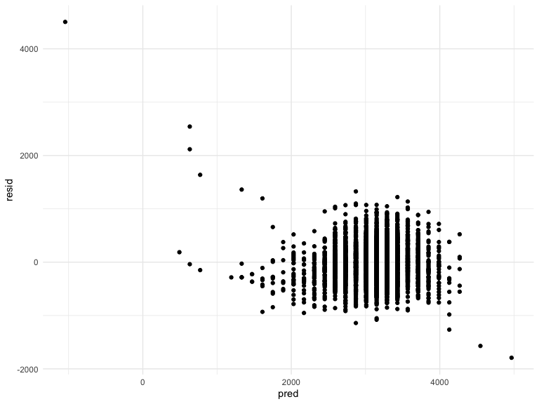

p8106_hw6_gw2442
================
2022-11-28

## Problem 2

#### Importing and describing raw data:

``` r
homicide_data = read_csv(file = "./data/homicide-data.csv") %>%
  janitor::clean_names()
```

    ## Rows: 52179 Columns: 12
    ## ── Column specification ────────────────────────────────────────────────────────
    ## Delimiter: ","
    ## chr (9): uid, victim_last, victim_first, victim_race, victim_age, victim_sex...
    ## dbl (3): reported_date, lat, lon
    ## 
    ## ℹ Use `spec()` to retrieve the full column specification for this data.
    ## ℹ Specify the column types or set `show_col_types = FALSE` to quiet this message.

``` r
skimr::skim(homicide_data)
```

|                                                  |               |
|:-------------------------------------------------|:--------------|
| Name                                             | homicide_data |
| Number of rows                                   | 52179         |
| Number of columns                                | 12            |
| \_\_\_\_\_\_\_\_\_\_\_\_\_\_\_\_\_\_\_\_\_\_\_   |               |
| Column type frequency:                           |               |
| character                                        | 9             |
| numeric                                          | 3             |
| \_\_\_\_\_\_\_\_\_\_\_\_\_\_\_\_\_\_\_\_\_\_\_\_ |               |
| Group variables                                  | None          |

Data summary

**Variable type: character**

| skim_variable | n_missing | complete_rate | min | max | empty | n_unique | whitespace |
|:--------------|----------:|--------------:|----:|----:|------:|---------:|-----------:|
| uid           |         0 |             1 |   9 |  10 |     0 |    52179 |          0 |
| victim_last   |         0 |             1 |   1 |  20 |     0 |    12687 |          0 |
| victim_first  |         0 |             1 |   1 |  28 |     0 |    16640 |          0 |
| victim_race   |         0 |             1 |   5 |   8 |     0 |        6 |          0 |
| victim_age    |         0 |             1 |   1 |   7 |     0 |      102 |          0 |
| victim_sex    |         0 |             1 |   4 |   7 |     0 |        3 |          0 |
| city          |         0 |             1 |   5 |  14 |     0 |       50 |          0 |
| state         |         0 |             1 |   2 |   2 |     0 |       28 |          0 |
| disposition   |         0 |             1 |  14 |  21 |     0 |        3 |          0 |

**Variable type: numeric**

| skim_variable | n_missing | complete_rate |        mean |         sd |          p0 |         p25 |         p50 |         p75 |          p100 | hist  |
|:--------------|----------:|--------------:|------------:|-----------:|------------:|------------:|------------:|------------:|--------------:|:------|
| reported_date |         0 |             1 | 20130899.16 | 1123419.63 | 20070101.00 | 20100318.00 | 20121216.00 | 20150911.00 | 201511105\.00 | ▇▁▁▁▁ |
| lat           |        60 |             1 |       37.03 |       4.35 |       25.73 |       33.77 |       38.52 |       40.03 |         45.05 | ▁▅▅▇▅ |
| lon           |        60 |             1 |      -91.47 |      13.75 |     -122.51 |      -96.00 |      -87.71 |      -81.76 |        -71.01 | ▃▁▃▇▅ |

The CSV file was downloaded from the GitHub repository, imported, and
cleaned. The dataset `homicide_data` has 52,179 rows and 12 columns. The
dataset contains information on the homicide ID number, reported date,
the victim’s first and last name, race, age, sex, location of homicide
(including city, state, longtidue, and latitude), and disposition of the
case. While there are 0 missing variables for variables `uid`,
`victim_last`, `victim_first`, `victim_race`, `victim_age`,
`victim_sex`, `city`, `state`, `disposition`, and `reported date`, there
are 60 missing variables for `lat` and `lon`.

#### Creating variable `city_state`:

``` r
homicide_data =
  homicide_data %>%
  mutate(
    city_state = as.character(paste(city, state, sep = "_")))
```

#### Creating variable `unsolved_homicide` and tidying data:

The variable `solved_homicide` was created. Those with the disposition
“Closed without arrest” or “Open/No arrest” were categorised as an
unsolved homicide and were therefore given a value of 0 in the variable
`solved_homicide`. Those with the disposition “Closed by arrest” were
categorised as a solved homicide and were therefore given a value of 1
in the variable `solved_homicide`.

The cities Dallas, Phoenix, Kansas City, and Tulsa were omitted from the
dataset, as well as any race entries other than White or Black and any
victim age’s that were non-numeric.

``` r
homicide_data = 
  homicide_data %>%
  mutate(solved_homicide = ifelse(disposition == "Closed by arrest", 1, 0)) %>%
  filter(city != "Dallas", 
         city != "Phoenix", 
         city != "Kansas City", 
         city != "Tulsa") %>%
  filter(victim_race == "White" | victim_race == "Black") %>%
  mutate(victim_age = as.numeric(victim_age)) %>%
  drop_na(victim_age)
```

#### Logistic regression on Baltimore, MD

A logistic regression was run for the city of Baltimore with resolved vs
unresolved as the outcome and victim age, sex, and race as predictors
using the `glm` function. The output was tidied using `broom::tidy`.
That output was used to determine the adjusted odds ratio and
corresponding 95% confidence interval (test statistics of 1.96) for the
city of Baltimore.

``` r
fit_logistic_baltimore = 
  homicide_data %>%
  filter(city == "Baltimore") %>%
  glm(solved_homicide ~ victim_age + victim_race + victim_sex, data = ., family = binomial()) %>%
  broom::tidy()

fit_logistic_baltimore %>%
  mutate(OR = exp(estimate),
         CI_lower = exp(estimate - 1.96*std.error),
         CI_upper = exp(estimate + 1.96*std.error)) %>%
  select(term, OR, CI_lower, CI_upper) %>%
  filter(term == "victim_sexMale")
```

    ## # A tibble: 1 × 4
    ##   term              OR CI_lower CI_upper
    ##   <chr>          <dbl>    <dbl>    <dbl>
    ## 1 victim_sexMale 0.426    0.325    0.558

The adjusted odds ratio for solving homicides comparing male victims to
female victims is 0.426 with a 95% confidence interval of (0.325,
0.558), keeping all other variables fixed.

In the city of Baltimore, the odds of solving a homicide with a male
victim is 0.426 times the odds of solving a homicide with a female
victim, keeping all other variables fixed.

#### Mapping logistic regression for all cities

The function `fit_logsitic_homicide` was created. It produces the
adjusted odds ratio for sovling homicides comparing male victims to
female victims and its corresponding 95% confidence interval. The
function was then mapped onto the nested data frame
`homicide_data_analysis`. The data frame was then unnested to obtain a
final data frame demonstrating each `city_state` and its corresponding
OR and CI.

``` r
fit_logistic_homicide = function(homicide_data) {
  glm(solved_homicide ~ victim_age + victim_race + victim_sex, data = homicide_data, family = binomial()) %>%
    broom::tidy() %>%
    mutate(OR = exp(estimate),
           CI_lower = exp(estimate - 1.96*std.error),
           CI_upper = exp(estimate + 1.96*std.error)) %>%
    select(term, OR, CI_lower, CI_upper) %>%
    filter(term == "victim_sexMale")
}

homicide_data_analysis = 
  homicide_data %>%
  select(city_state, everything()) %>%
  nest(data = uid:solved_homicide) %>%
  mutate(regression_result = purrr::map(.x = data, ~fit_logistic_homicide(.x))) %>%
  unnest(cols = regression_result)
```

#### Plotting OR and CI’s

A plot demonstrating the estimated ORs and CIs for each city was created
from the unnested data frame `homicide_data_analysis`. It is organised
according to estimated OR.

``` r
homicide_data_analysis %>%
  mutate(city_state = fct_reorder(city_state, OR)) %>%
  ggplot(aes(x = city_state, y = OR)) + 
  geom_errorbar(aes(ymin= CI_lower, ymax= CI_upper)) +
  geom_point() +
  theme(axis.text.x = element_text(angle = 45, hjust=1)) +
  labs(
        x = "Cities",
        y = "Odds Ratio",
        title = "Odds Ratio for Solving Homicides Comparing Male Victims to Female Victims")
```


The plot demonstrates that Albuquerque, NM has the highest odds for
solving homicides with male victims compared to female victims. However,
it’s 95% CI is extremely wide, especially compared to the other cities
in the dataset. New York, NY has the lowest odds for solving homicides
with male victims compared to female victims.

## Problem 3

#### Loading and cleaning data for regression analysis

``` r
bw_data = read_csv(file = "./data/birthweight.csv") %>%
  janitor::clean_names()
```

    ## Rows: 4342 Columns: 20
    ## ── Column specification ────────────────────────────────────────────────────────
    ## Delimiter: ","
    ## dbl (20): babysex, bhead, blength, bwt, delwt, fincome, frace, gaweeks, malf...
    ## 
    ## ℹ Use `spec()` to retrieve the full column specification for this data.
    ## ℹ Specify the column types or set `show_col_types = FALSE` to quiet this message.

``` r
skimr::skim(bw_data)
```

|                                                  |         |
|:-------------------------------------------------|:--------|
| Name                                             | bw_data |
| Number of rows                                   | 4342    |
| Number of columns                                | 20      |
| \_\_\_\_\_\_\_\_\_\_\_\_\_\_\_\_\_\_\_\_\_\_\_   |         |
| Column type frequency:                           |         |
| numeric                                          | 20      |
| \_\_\_\_\_\_\_\_\_\_\_\_\_\_\_\_\_\_\_\_\_\_\_\_ |         |
| Group variables                                  | None    |

Data summary

**Variable type: numeric**

| skim_variable | n_missing | complete_rate |    mean |     sd |     p0 |     p25 |     p50 |     p75 |   p100 | hist  |
|:--------------|----------:|--------------:|--------:|-------:|-------:|--------:|--------:|--------:|-------:|:------|
| babysex       |         0 |             1 |    1.49 |   0.50 |   1.00 |    1.00 |    1.00 |    2.00 |    2.0 | ▇▁▁▁▇ |
| bhead         |         0 |             1 |   33.65 |   1.62 |  21.00 |   33.00 |   34.00 |   35.00 |   41.0 | ▁▁▆▇▁ |
| blength       |         0 |             1 |   49.75 |   2.72 |  20.00 |   48.00 |   50.00 |   51.00 |   63.0 | ▁▁▁▇▁ |
| bwt           |         0 |             1 | 3114.40 | 512.15 | 595.00 | 2807.00 | 3132.50 | 3459.00 | 4791.0 | ▁▁▇▇▁ |
| delwt         |         0 |             1 |  145.57 |  22.21 |  86.00 |  131.00 |  143.00 |  157.00 |  334.0 | ▅▇▁▁▁ |
| fincome       |         0 |             1 |   44.11 |  25.98 |   0.00 |   25.00 |   35.00 |   65.00 |   96.0 | ▃▇▅▂▃ |
| frace         |         0 |             1 |    1.66 |   0.85 |   1.00 |    1.00 |    2.00 |    2.00 |    8.0 | ▇▁▁▁▁ |
| gaweeks       |         0 |             1 |   39.43 |   3.15 |  17.70 |   38.30 |   39.90 |   41.10 |   51.3 | ▁▁▂▇▁ |
| malform       |         0 |             1 |    0.00 |   0.06 |   0.00 |    0.00 |    0.00 |    0.00 |    1.0 | ▇▁▁▁▁ |
| menarche      |         0 |             1 |   12.51 |   1.48 |   0.00 |   12.00 |   12.00 |   13.00 |   19.0 | ▁▁▂▇▁ |
| mheight       |         0 |             1 |   63.49 |   2.66 |  48.00 |   62.00 |   63.00 |   65.00 |   77.0 | ▁▁▇▂▁ |
| momage        |         0 |             1 |   20.30 |   3.88 |  12.00 |   18.00 |   20.00 |   22.00 |   44.0 | ▅▇▂▁▁ |
| mrace         |         0 |             1 |    1.63 |   0.77 |   1.00 |    1.00 |    2.00 |    2.00 |    4.0 | ▇▇▁▁▁ |
| parity        |         0 |             1 |    0.00 |   0.10 |   0.00 |    0.00 |    0.00 |    0.00 |    6.0 | ▇▁▁▁▁ |
| pnumlbw       |         0 |             1 |    0.00 |   0.00 |   0.00 |    0.00 |    0.00 |    0.00 |    0.0 | ▁▁▇▁▁ |
| pnumsga       |         0 |             1 |    0.00 |   0.00 |   0.00 |    0.00 |    0.00 |    0.00 |    0.0 | ▁▁▇▁▁ |
| ppbmi         |         0 |             1 |   21.57 |   3.18 |  13.07 |   19.53 |   21.03 |   22.91 |   46.1 | ▃▇▁▁▁ |
| ppwt          |         0 |             1 |  123.49 |  20.16 |  70.00 |  110.00 |  120.00 |  134.00 |  287.0 | ▅▇▁▁▁ |
| smoken        |         0 |             1 |    4.15 |   7.41 |   0.00 |    0.00 |    0.00 |    5.00 |   60.0 | ▇▁▁▁▁ |
| wtgain        |         0 |             1 |   22.08 |  10.94 | -46.00 |   15.00 |   22.00 |   28.00 |   89.0 | ▁▁▇▁▁ |

``` r
bw_data %>%
  distinct(babysex) 
```

    ## # A tibble: 2 × 1
    ##   babysex
    ##     <dbl>
    ## 1       2
    ## 2       1

``` r
bw_data %>%
  distinct(frace)
```

    ## # A tibble: 5 × 1
    ##   frace
    ##   <dbl>
    ## 1     1
    ## 2     2
    ## 3     3
    ## 4     4
    ## 5     8

``` r
bw_data %>%
  distinct(malform)
```

    ## # A tibble: 2 × 1
    ##   malform
    ##     <dbl>
    ## 1       0
    ## 2       1

``` r
bw_data %>%
  distinct(mrace)
```

    ## # A tibble: 4 × 1
    ##   mrace
    ##   <dbl>
    ## 1     1
    ## 2     2
    ## 3     3
    ## 4     4

``` r
bw_data =
  bw_data %>%
  mutate(
    babysex = factor(babysex, labels = c("male", "female")),
    frace = factor(frace, labels = c("white", "black", "asian", "puerto rican", "other")),
    malform = factor(malform, labels = c("absent", "present")),
    mrace = factor(mrace, labels = c("white", "black", "asian", "puerto rican")), 
  )

skimr::skim(bw_data)
```

|                                                  |         |
|:-------------------------------------------------|:--------|
| Name                                             | bw_data |
| Number of rows                                   | 4342    |
| Number of columns                                | 20      |
| \_\_\_\_\_\_\_\_\_\_\_\_\_\_\_\_\_\_\_\_\_\_\_   |         |
| Column type frequency:                           |         |
| factor                                           | 4       |
| numeric                                          | 16      |
| \_\_\_\_\_\_\_\_\_\_\_\_\_\_\_\_\_\_\_\_\_\_\_\_ |         |
| Group variables                                  | None    |

Data summary

**Variable type: factor**

| skim_variable | n_missing | complete_rate | ordered | n_unique | top_counts                              |
|:--------------|----------:|--------------:|:--------|---------:|:----------------------------------------|
| babysex       |         0 |             1 | FALSE   |        2 | mal: 2230, fem: 2112                    |
| frace         |         0 |             1 | FALSE   |        5 | whi: 2123, bla: 1911, pue: 248, asi: 46 |
| malform       |         0 |             1 | FALSE   |        2 | abs: 4327, pre: 15                      |
| mrace         |         0 |             1 | FALSE   |        4 | whi: 2147, bla: 1909, pue: 243, asi: 43 |

**Variable type: numeric**

| skim_variable | n_missing | complete_rate |    mean |     sd |     p0 |     p25 |     p50 |     p75 |   p100 | hist  |
|:--------------|----------:|--------------:|--------:|-------:|-------:|--------:|--------:|--------:|-------:|:------|
| bhead         |         0 |             1 |   33.65 |   1.62 |  21.00 |   33.00 |   34.00 |   35.00 |   41.0 | ▁▁▆▇▁ |
| blength       |         0 |             1 |   49.75 |   2.72 |  20.00 |   48.00 |   50.00 |   51.00 |   63.0 | ▁▁▁▇▁ |
| bwt           |         0 |             1 | 3114.40 | 512.15 | 595.00 | 2807.00 | 3132.50 | 3459.00 | 4791.0 | ▁▁▇▇▁ |
| delwt         |         0 |             1 |  145.57 |  22.21 |  86.00 |  131.00 |  143.00 |  157.00 |  334.0 | ▅▇▁▁▁ |
| fincome       |         0 |             1 |   44.11 |  25.98 |   0.00 |   25.00 |   35.00 |   65.00 |   96.0 | ▃▇▅▂▃ |
| gaweeks       |         0 |             1 |   39.43 |   3.15 |  17.70 |   38.30 |   39.90 |   41.10 |   51.3 | ▁▁▂▇▁ |
| menarche      |         0 |             1 |   12.51 |   1.48 |   0.00 |   12.00 |   12.00 |   13.00 |   19.0 | ▁▁▂▇▁ |
| mheight       |         0 |             1 |   63.49 |   2.66 |  48.00 |   62.00 |   63.00 |   65.00 |   77.0 | ▁▁▇▂▁ |
| momage        |         0 |             1 |   20.30 |   3.88 |  12.00 |   18.00 |   20.00 |   22.00 |   44.0 | ▅▇▂▁▁ |
| parity        |         0 |             1 |    0.00 |   0.10 |   0.00 |    0.00 |    0.00 |    0.00 |    6.0 | ▇▁▁▁▁ |
| pnumlbw       |         0 |             1 |    0.00 |   0.00 |   0.00 |    0.00 |    0.00 |    0.00 |    0.0 | ▁▁▇▁▁ |
| pnumsga       |         0 |             1 |    0.00 |   0.00 |   0.00 |    0.00 |    0.00 |    0.00 |    0.0 | ▁▁▇▁▁ |
| ppbmi         |         0 |             1 |   21.57 |   3.18 |  13.07 |   19.53 |   21.03 |   22.91 |   46.1 | ▃▇▁▁▁ |
| ppwt          |         0 |             1 |  123.49 |  20.16 |  70.00 |  110.00 |  120.00 |  134.00 |  287.0 | ▅▇▁▁▁ |
| smoken        |         0 |             1 |    4.15 |   7.41 |   0.00 |    0.00 |    0.00 |    5.00 |   60.0 | ▇▁▁▁▁ |
| wtgain        |         0 |             1 |   22.08 |  10.94 | -46.00 |   15.00 |   22.00 |   28.00 |   89.0 | ▁▁▇▁▁ |

Variables `babysex`, `frace`, `malform`, and `mrace` were converted to
factor variables, as they were all categorical variables. Variable
`frace` had no “Unknown” (9) inputs. Variable `mrace` had no “Other” (8)
inputs. Therefore, they were omitted when labeling the factor variables.
The function `skimr::skim` demonstrates that there are no missing data
for any of the variables.

#### Proposed regression model for birthweight

We hypothesise that a baby’s birth weight is dependent on the baby’s
length at birth (cm).

``` r
bw_data %>%
  ggplot(aes(x = blength, y = bwt)) + 
  geom_point(alpha = 0.5)
```


Based on the plot above, baby’s length at birth seems to be positively
correlated with the baby’s birth weight.

To test this hypothesis, we run a regression model with birth weight as
the outcome and baby’s length at birth as a predictor. This model is
illustrated in the plot below, with predictions on the x axis and
residuals on the y axis.

``` r
fit = lm(bwt ~ blength, data = bw_data) 

bw_data = 
  bw_data %>%
  mutate(
    modelr::add_residuals(bw_data, fit),
    modelr::add_predictions(bw_data, fit))

bw_data %>%
  ggplot(aes(x = pred, y = resid)) +
  geom_point()
```



``` r
fit %>%
  broom::tidy() %>%
  knitr::kable()
```

| term        |   estimate | std.error | statistic | p.value |
|:------------|-----------:|----------:|----------:|--------:|
| (Intercept) | -3841.2667 | 95.122166 | -40.38246 |       0 |
| blength     |   139.8109 |  1.909124 |  73.23301 |       0 |

#### Comparing models

The model above was compared with two models:

-   One using length at birth and gestational age as predictors (fit_2)

-   One using head circumference, length, sex, and all interactions as
    predictors (fit_3)

Comparison Models:

``` r
fit_2 = lm (bwt ~ blength + gaweeks, data = bw_data)

fit_3 = lm(bwt ~ bhead + blength + babysex + bhead*blength + bhead*babysex + blength*babysex + bhead*blength*babysex, data = bw_data)
```

These three models (`fit`, `fit_2`, and `fit_3`) were compared in terms
of the cross-validated prediction error. The `crossv_mc` function was on
the `bw_data` dataset to producing training and testing data sets. The
candidate models were then fit and its corresponding RMSEs were obtained
using `mutate` + `map` & `map2`.

``` r
cv_df = 
  crossv_mc(bw_data, 100)

cv_df = 
  cv_df %>%
  mutate(
    train = map(train, as_tibble),
    test = map(test, as_tibble)
  )

cv_df = 
  cv_df %>%
  mutate(
    fit_mod   = map(train, ~lm(bwt ~ blength, data = .x)),
    fit_2_mod = map(train, ~lm(bwt ~ blength + gaweeks, data = .x)),
    fit_3_mod = map(train, ~lm(bwt ~ bhead + blength + babysex + bhead*blength + bhead*babysex + blength*babysex + bhead*blength*babysex, data = .x))) %>%
  mutate(
    rmse_fit   = map2_dbl(fit_mod, test, ~rmse(model = .x, data = .y)),
    rmse_fit_2 = map2_dbl(fit_2_mod, test, ~rmse(model = .x, data = .y)),
    rmse_fit_3 = map2_dbl(fit_3_mod, test, ~rmse(model = .x, data = .y))
  )
```

The plot below shows the distribution of RMSE values for each candidate
model.

``` r
cv_df %>%
  select(starts_with("rmse")) %>%
  pivot_longer(
    everything(),
    names_to = "model",
    values_to = "rmse",
    names_prefix = "rmse_") %>%
  mutate(model = fct_inorder(model)) %>%
  ggplot(aes(x = model, y = rmse)) +
  geom_violin() +
  labs(
    x = "model",
    y = "rmse",
    title = "Distribution of RMSE values for each model"
    )
```


RMSE is a metric that ranges from 0 to infinity. Models with a lower
value are better able to “fit” the data set. Based on the plot above,
the fit_3 model (using head circumference, length, sex, and all
interactions) would be most appropriate, as it demonstrates the lowest
RMSE value. However, all models demonstrate an extremely high RMSE
value, as RMSE values between 0.2 and 0.5 indicate a relatively accurate
prediction model. The RMSE in all three of the models above greately
exceed these numbers.
